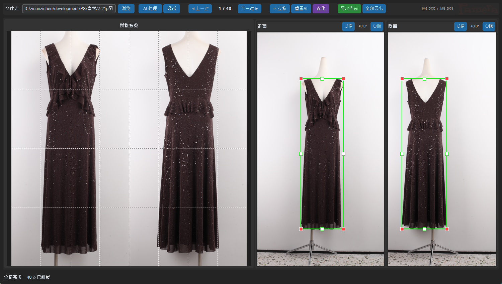

# Garment Front-Back Stitcher

桌面端离线工具，AI 检测 + CV 联合轮廓匹配 + 人工审核，将服装样品正反面照片裁切拼接为 1:1 正方形结果图。

---

## 功能概览

| 功能 | 说明 |
|------|------|
| **AI+CV 联合检测** | rembg 初次定位 → 逐行宽度分布 → 正反面共识区间 → 杆子底部裁剪 |
| **流式处理** | 逐对处理，第一对完成即可开始审核，后台并行加载后续对 |
| **审核编辑** | 绿框拖拽（4 角 + 4 边中点 + 整体平移）+ 角度微调 + 互换正反面 |
| **液化修图** | PS 风格前推变形，60fps 脏区域渲染，三层同心笔刷光标 |
| **批量导出** | 导出当前或全部导出，液化结果在导出时自动生效 |
| **断点续审** | 所有编辑自动保存到 `annotations.json`，再次打开文件夹秒加载 |
| **调试窗口** | 6 步 AI/CV 中间产物可视化（rembg mask → bbox → 宽度分布 → 共识 → 杆子裁剪 → 结果） |

---

## 快速开始

```bash
pip install -r requirements.txt
python reviewer.py
```

1. **浏览** 选择原图文件夹 → AI 模型后台预热
2. 点击 **AI 处理**（如有 `annotations.json` 则秒加载）
3. **左窗** 实时预览拼接结果（滚轮缩放 1-5×）
4. **右窗** 拖拽绿框 / 点击角度旋钮微调
5. **液化** 可选修图 → 应用后预览刷新
6. **导出** 当前对（S 键）或全部导出

---

## GUI 布局



---

## AI+CV 检测管线

每对图片依次执行 6 个步骤：

```
① AI 分割 (rembg u2net, 168MB)
   对比度增强 1.4× → onnxruntime 推理 → 前景 mask
   ↓
② 初始 BBox
   mask 最左/最右/最上/最下 → 包围盒
   ↓
③ CV 轮廓分析
   逐行扫描 mask 宽度 → 正反面宽度比 → 共识区间 (ratio < 1.35)
   ↓
④ CV 共识提炼
   在最长共识区间内重新计算 bbox → 滤除人台/支架不对称噪声
   ↓
⑤ CV 杆子裁剪
   mask 宽度占比骤降 (< 身体参考 20%) → 切除底部金属杆
   ↓
⑥ 合并输出
   统一裁切 → bbox 居中 → 1:1 正方形拼接
```

### 为什么用联合匹配

单独每张跑 rembg 会把金属杆、人台、浅色背景误认为衣服。但正反面服装区域是**高度对称**的：同一行像素，正面服装宽度 ≈ 反面服装宽度。利用这个约束：

- 逐行计算正反面宽度比 `max(a, b) / min(a, b)`
- 比例 < 1.35 → 对称 → 真实服装
- 比例 > 1.35 → 不对称 → 噪声（杆子/人台/误检测）
- 取最大连续共识区间 → 商品真实 Y 范围

---

## 数据流

```
输入文件夹 (字典序, 奇偶配对)
  ↓
annotations.json 存在且完整？
  ├─ 是 → 秒加载，跳过 AI
  └─ 否 → CPU 流式处理
       ├─ rembg 推理 (_single_pipe)
       ├─ 轮廓共识匹配 (_joint_detect)
       └─ 全部完成后写入 annotations.json
  ↓
人工审核 (拖框/调角度/互换/液化)
  ↓  每次编辑 800ms 防抖自动保存
  ↓
导出 (当前/全部)
  ├─ 有液化结果 → 导出液化图
  └─ 无液化结果 → 拼接后导出
  → 审核输出/<stem>.png
```

### annotations.json 格式

```json
{
  "source_dir": "D:\\素材\\7-21p图",
  "annotations": [
    {"file": "IMG_5952.JPG", "bbox": [817, 701, 1735, 3549], "angle": 0.0},
    {"file": "IMG_5953.JPG", "bbox": [680, 748, 1673, 3060], "angle": 0.0}
  ]
}
```

- AI 处理后自动生成
- 再次浏览同一文件夹 → 秒开，无需重新推理
- 再次点击「AI 处理」→ 清空重跑，覆盖旧文件
- 只存储 bbox + 角度，不存储液化结果

---

## 操作参考

### 快捷键

| 键 | 功能 |
|----|------|
| ← → | 上一对 / 下一对 |
| E / S | 导出当前 |
| X | 互换正反面 |
| R | 归零角度 |
| F | 适应窗口 |
| < , > | 逆 / 顺时针微调 0.5° |

### 液化工具

| 操作 | 效果 |
|------|------|
| 左键拖拽 | 前推变形 |
| 空格 + 左键拖 | 平移视图 |
| 滚轮 | 缩放视图 |
| Ctrl + 滚轮 | 笔刷大小 ±10 |
| `[` `]` | 笔刷 ±5 |
| Alt + 右键拖 | 缩放 |
| Ctrl + Z | 撤销 (最多 50 步) |
| Enter | 应用并返回主界面 |
| Escape | 取消 |

### 预览缩放

鼠标移入左侧预览框，滚轮缩放 1.0× – 5.0×，切换图片自动重置。

---

## 技术栈

| 组件 | 用途 |
|------|------|
| **rembg** (u2net.onnx) | AI 前景分割，底层使用 onnxruntime 推理 |
| **onnxruntime** | ONNX 模型推理引擎 |
| **Pillow** | 图像读取/裁切/旋转/拼接/EXIF |
| **NumPy** | mask 数组运算、垂直轮廓扫描 |
| **SciPy** | 液化变形网格插值 (scipy.ndimage.map_coordinates) |
| **customtkinter + tkinter** | 桌面 GUI |
| **svglib / svgpathtools** | SVG logo 渲染 |
| **PyInstaller** | 打包为 onedir 安装包 |

完全离线运行，模型 (168MB) 内置于安装包，无需联网下载。


---

## 目录结构

```
├── reviewer.py            # 审核编辑 GUI (主入口)
├── processor_v11.py        # AI+CV 检测核心
├── liquify.py              # PS 风格液化修图工具
├── annotator.py            # 手动标注工具
├── batch_manual.py         # 基于标注的批量导出
├── gui.py / main.py        # 旧版 GUI
├── build_icon.py           # logo.svg → PNG/ICO 渲染
├── garment-stitcher.spec   # PyInstaller 打包配置
├── requirements.txt        # Python 依赖
├── logo.svg                # 品牌源文件
├── CLAUDE.md               # AI 开发参考
└── README.md
```

---

## 打包为安装包

```bash
pip install pyinstaller svgpathtools

# 1. 生成 Logo 图标
python build_icon.py

# 2. 复制 rembg AI 模型
mkdir models
cp ~/.u2net/u2net.onnx models/

# 3. 构建
python -m PyInstaller garment-stitcher.spec

# 4. 打包为安装程序（需安装 NSIS: winget install NSIS.NSIS）
"C:\Program Files (x86)\NSIS\Bin\makensis.exe" installer.nsi
```

构建产物：`dist/GarmentStitcher_Setup.exe`

安装后目录结构：
```
C:\Program Files\GarmentStitcher\
├── GarmentStitcher.exe        # 主程序（17MB 引导程序）
├── _internal\                 # Python 运行时 + 依赖 + AI 模型
│   ├── models\u2net.onnx      # rembg AI 模型 (168MB)
│   ├── logo.ico / logo_*.png  # 品牌图标
│   ├── python312.dll          # Python 解释器
│   └── ...（所有依赖库）
└── uninstall.exe              # 卸载程序
```

开始菜单 + 桌面快捷方式，控制面板可卸载。

启动后预设行为：

- 窗口打开 → 后台加载 u2net 模型（状态栏黄色显示「模型加载中…」→「模型就绪」）
- 浏览有 `annotations.json` 且覆盖全部图片的文件夹 → 秒加载，直接开始审核
- 浏览有 `annotations.json` 但只覆盖部分图片的文件夹 → 加载已有标注，提示剩余多少对需处理
- 浏览新文件夹 → 提示点击「AI 处理」开始推理

---

## 输入要求

- 文件名按字典序排列，两两配对（奇数位 = 正面，偶数位 = 反面）
- 支持 JPG / PNG / BMP / TIFF
- 棚拍照片，模特居中，渐变灰背景
- 建议分辨率 ≤ 4080px 以保证 AI 处理速度
