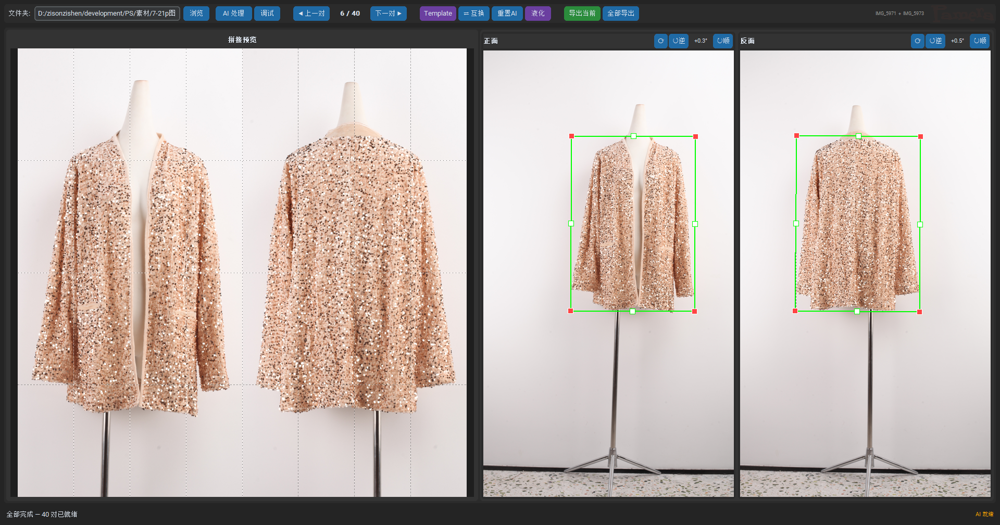

# Garment Front-Back Stitcher

桌面端离线工具，AI 检测 + CV 联合轮廓匹配 + 自动角度修正 + 人工审核，将服装样品正反面照片裁切拼接为 1:1 正方形结果图。

---

## 功能概览

| 功能 | 说明 |
|------|------|
| **AI+CV 联合检测** | rembg 前景分割 → 逐行宽度分布 → 正反面共识区间 → 杆子底部裁剪 |
| **自动角度修正** | Theil-Sen 中轴 / 模板对齐 双算法可切换 → 自动检测并纠正服装倾斜 |
| **流式处理** | 逐对处理，第一对完成即可开始审核，后台并行加载后续对 |
| **审核编辑** | BBox 拖拽（4 角 + 4 边中点 + 整体平移）+ 角度微调 + 互换正反面 |
| **液化修图** | PS 风格前推变形，60fps 脏区域渲染 |
| **批量导出** | 导出当前或全部导出，液化结果在导出时自动生效 |
| **断点续审** | 所有编辑自动保存到 `annotations.json`，再次打开文件夹秒加载 |
| **调试窗口** | 7+ 步 AI/CV/角度中间产物可视化 |

---

## 快速开始

```bash
pip install -r requirements.txt
python reviewer.py
```

1. **浏览** 选择原图文件夹 → AI 模型后台预热（状态栏显示加载耗时）
2. 点击 **AI 处理**（如有完整的 `annotations.json` 则秒加载）
3. **左窗** 实时预览拼接结果（滚轮缩放）
4. **右窗** 拖拽绿框 / 角度微调按钮 / ⟳ 重置按钮
5. **液化** 可选修图 → 应用后预览刷新
6. **导出** 当前对或全部导出

---

## GUI 布局



### 演示视频

<video src="演示视频.mp4" controls width="100%"></video>

---

## AI+CV 检测管线

```
① rembg u2net 前景分割 (168MB)
   对比度增强 1.4× → onnxruntime 推理 → 前景 mask
   ↓
② 初始 BBox
   mask 最左/最右/最上/最下 → 包围盒
   ↓
③ 联合轮廓共识
   逐行正反面宽度比 < 1.35 → 共识区间 → 排除人台/支架噪声
   ↓
④ 共识提炼
   在最长共识区间内重新计算 bbox
   ↓
⑤ 杆子底部裁剪
   mask 宽度占比骤降 → 切除金属杆/人台底部
   ↓
⑥ 自动角度修正
   检测服装中轴倾斜并补偿（见下方详解）
   ↓
⑦ 1:1 正方形拼接输出
```

---

## 自动角度修正

AI 处理后自动为每面计算旋转校正角，用户可以接受或手动覆盖。工具栏按钮 `TheilSen` / `Template` 切换算法，调试内容同步切换。

### 算法 A: Theil-Sen 中轴法 (默认)

对每张照片单独处理，不依赖正反面配对。

```
bbox 内 mask
  → 逐行取左右边界中点 (x_mid, y)
  → Theil-Sen 中位数斜率拟合
  → 3σ 异常行剔除 → 重拟合
  → arctan(slope) = 中轴倾斜角
  → 校正角 = -中轴倾斜角
```

**Theil-Sen 中位数斜率**：对 N 行生成 N 个中点，取所有间隔 ≥ N/3 行的点对算斜率，取中位数。比最小二乘线性回归抗异常值能力强得多（breakdown point = 29%）。3σ 剔除进一步过滤因不对称设计（单肩、侧开叉）偏移的中行。

**优点**：每面独立计算，不假设正反面同角度旋转；纯算术，不做 mask 旋转无裁边噪声。

### 算法 B: 模板对齐法

利用正反面服装轮廓物理上一致（同一件衣服）的特性。

```
Step 1: 翻背面水平翻转 → 正面镜像
Step 2: ±0.5°×0.1° 网格搜索 (a,b)
       正面旋转 a + 翻背面旋转 b → 像素重叠最大化
Step 3: 模板 mask = 正面(a) ∩ 翻背面(b) → 共识服装轮廓
Step 4: 模板 Theil-Sen 中轴倾角 → 旋正模板
Step 5: 正面独立搜索与正模板重叠最大的角 → angle_a
        翻背面独立搜索与正模板重叠最大的角 → angle_b
```

**优点**：共识模板自动抵消了单面不对称噪声（单肩设计在正面偏左侧、在翻背面偏右侧，交集消除）。两张图互相补充 mask 缺陷。

**两个算法的差异**：
- Theil-Sen 是向量空间法——几何严谨但依赖逐行中点信号质量
- 模板对齐是像素空间法——利用镜像对称约束，对个别行噪声免疫
- 当两者偏差 < 0.5° 时取平均融合；> 0.5° 时表示有一方不可靠，取 Theil-Sen

### 手动微调

- 每个面有独立的角度旋转按钮（↻顺 / ↺逆 / ⟳重置）
- 快捷键 `,` / `.` 旋转 0.5°
- `R` 清零全部旋转
- `X` 互换正反面
- 手动拖拽 BBox 后**不再自动重算角度**（手动介入 = 用户已有判断）

---

## 数据流

```
输入文件夹 (字典序, 奇偶配对)
  ↓
annotations.json 存在且完整？
  ├─ 是 → 秒加载，跳过 AI
  └─ 否 → CPU 流式处理
       ├─ rembg 推理 (_single_pipe)
       ├─ 轮廓共识匹配 (_joint_detect)
       ├─ 自动角度修正 (mask_centerline_angle)
       └─ 全部完成后写入 annotations.json
  ↓
人工审核 (拖框/调角度/互换/切换算法/液化)
  ↓  每次编辑 800ms 防抖自动保存
  ↓
导出 (当前/全部)
  ├─ 有液化结果 → 导出液化图
  └─ 无液化结果 → 拼接后导出
  → 审核输出/<stem>.png
```

### annotations.json 格式

```json
{
  "source_dir": "D:\\素材\\7-21p图",
  "annotations": [
    {"file": "IMG_5952.JPG", "bbox": [817, 701, 1735, 3549], "angle": 0.7},
    {"file": "IMG_5953.JPG", "bbox": [680, 748, 1673, 3060], "angle": 0.6}
  ]
}
```

- AI 处理后自动生成（包含自动角度）
- 再次浏览同一文件夹 → 秒开，无需重新推理
- 再次点击「AI 处理」→ 清空重跑，覆盖旧文件
- 只存储 bbox + 角度，不存储液化结果

---

## 调试窗口

点击工具栏「调试」按钮，对当前查看的那对执行全流程诊断，弹出滚动窗口展示每步的可视化结果。

### Theil-Sen 模式（7 步）

```
① AI 分割 — rembg mask 半透明绿色叠加
② 初步 BBox — 橙色包围盒
③ 宽度分布 & 共识区间 — 蓝/红宽度曲线 + 黄色比率 + 绿色共识区域
④ CV 共识提炼 — 黄框(前) vs 绿框(后) 对比
⑤ 杆子裁剪 — 裁剪前后 bbox 对比
⑥ Theil-Sen 中轴 — mask 叠加 + 逐行中点(黄色) + 拟合线(绿色) + 垂直参考(红色)
⑦ 最终结果 — 绿色 BBox 输出
```

### Template 模式（12 步）

```
①-⑤ 同 Theil-Sen
⑥ S1 网格搜索 — 角度 × 角度 重叠热力图，亮=高重叠，黄圈=最优角
⑦ S2 对齐重叠 — 正面(绿) + 翻背面旋转后(蓝) + 重叠(黄)
⑧ S3 模板 mask — 仅模板=黄、仅正面=绿、仅背面=蓝。显示模板像素数
⑨ S4 摆正模板 — 共识模板旋正到垂直 → 黄色区域 = 最准的服装轮廓
⑩ S5 独立搜索 — 正面(红)/背面(蓝) 各自对模板的重叠曲线，圈=最优角
⑪ 最终结果 — 绿色 BBox 输出
```

---

## 操作参考

### 快捷键

| 键 | 功能 |
|----|------|
| ← → | 上一对 / 下一对 |
| E / S | 导出当前 |
| X | 互换正反面 |
| R | 归零角度 |
| F | 适应窗口 |
| F1 | 关于对话框 |
| , / . | 该面-0.5° / +0.5° |

### 液化工具

| 操作 | 效果 |
|------|------|
| 左键拖拽 | 前推变形 |
| 空格 + 左键拖 | 平移视图 |
| 滚轮 | 缩放视图 |
| Ctrl + 滚轮 | 笔刷大小 ±10 |
| `[` `]` | 笔刷 ±5 |
| Ctrl + Z | 撤销 (最多 50 步) |
| Enter | 应用并返回 |
| Escape | 取消 |

---

## Mask 标注工具

将 rembg 误识别的人台/杆子区域从 mask 中擦除，训练微调模型的前置步骤。

### 启动

```bash
python mask_annotator.py <素材目录>
```

### 操作

| 操作 | 效果 |
|------|------|
| 左键拖拽 | 擦除 mask（涂抹区域变透明，红色消失） |
| 右键拖拽 | 恢复 mask（被误擦的衣服区域） |
| ← → / ◀ ▶ | 上一张 / 下一张（**自动保存**） |
| S / Enter | 仅保存，不切换 |
| R | 重置为原始 rembg mask |
| F | 适应窗口 |
| Ctrl + 滚轮 / `[` `]` | 笔刷大小 ±5 |
| 中键拖拽 | 平移视图 |
| Escape | 退出 |

### 输出

每张图保存为 `<原图文件名>_mask.png`（灰度 PNG：白色=保留，黑色=排除）。
reviewer 的 AI 处理会**自动检测并使用**——存在 `_mask.png` 时跳过 rembg。

---

## U-2-Net 微调

用人手标注的 mask 数据微调前景分割模型，替代 rembg 的通用 u2net。

### 标注数据准备

1. 用 `mask_annotator.py` 在素材目录中逐张擦除人台/杆子区域
2. 标完后，`*_mask.png` 与对应原图在同一目录下即为可用数据
3. 支持多目录合并训练（逗号分隔）

### 训练

```bash
# 首次微调（从 HuggingFace 预训练权重开始）
python train_u2net.py --data "素材/7-21p图" --epochs 30 --batch 4

# 从微调模型继续训练（更多标注数据）
python train_u2net.py --data "素材/7-21p图,素材/微调标注" --epochs 20 --batch 4 --lr 5e-6

# 断点续训
python train_u2net.py --data "素材/7-21p图" --epochs 30 --batch 4 --resume models/ckpt_epoch10.pt
```

### 参数

| 参数 | 默认值 | 说明 |
|------|--------|------|
| `--data` | `素材/7-21p图` | 标注数据目录（逗号分隔多目录） |
| `--epochs` | 30 | 训练轮数 |
| `--batch` | 8 | batch size（4GB VRAM 用 4） |
| `--size` | 320 | 输入分辨率 |
| `--lr` | 1e-5 | 学习率 |
| `--resume` | — | 从检查点续训（恢复 optimizer 状态） |
| `--pretrained` | — | 预训练权重路径（默认自动下载 HF） |
| `--save-every` | 10 | 每 N 轮保存检查点 |
| `--no-augment` | — | 禁用数据增强（续训后期数据量够时可用） |

### 输出

| 文件 | 说明 |
|------|------|
| `models/best.pt` | 最佳模型权重（PyTorch） |
| `models/u2net_finetuned.onnx` | 导出为 ONNX 格式 |
| `models/ckpt_epochN.pt` | 每 N 轮检查点（含 optimizer 状态，可续训） |

### 使用

`processor_v11.py` 在启动时自动检测 `models/u2net_finetuned.onnx`：

```
存在 → 用微调模型跑 mask（跳过 rembg）
不存在 → 回退到 rembg 原始 u2net
```

无需额外配置。reviewer 打开即用微调模型。

### 训练数据

| 轮次 | 数据量 | 起点 loss | 最佳 loss | 说明 |
|------|--------|-----------|-----------|------|
| Round 1 | 85 对 | 0.117 | 0.042 | 从 HF 预训练权重开始 |
| Round 2 | 211 对 | 0.080 | 0.040 | 从 Round 1 最佳继续，追加 131 对 |
| Round 3 | 289 对 | 0.043 | 0.037 | 从 Round 2 最佳继续，追加 24+54 对 |

| 组件 | 用途 |
|------|------|
| **rembg / u2net.onnx** | AI 前景分割，默认 onnxruntime 推理 |
| **U-2-Net 微调** | PyTorch 微调管线，用标注数据训练自定义分割模型 → 导出 ONNX |
| **onnxruntime** | ONNX 模型推理引擎 |
| **Pillow** | 图像读取/裁切/旋转/拼接/EXIF |
| **NumPy** | mask 数组运算、统计拟合、手写旋转 |
| **SciPy** | 液化变形网格插值 (scipy.ndimage.map_coordinates) |
| **customtkinter + tkinter** | 桌面 GUI |
| **PyInstaller** | 打包为 onedir 安装包 |
| **NSIS** | Windows 安装程序 |

完全离线运行，模型 (168MB) 内置于安装包，无需联网下载。

---

## 目录结构

```
├── reviewer.py              # 审核编辑 GUI (主入口)
├── processor_v11.py         # AI+CV 检测核心 + 双角度算法
├── liquify.py               # PS 风格液化修图工具
├── annotator.py             # 手动 BBox 标注工具
├── mask_annotator.py        # Mask 画笔标注工具（擦除人台区域）
├── train_u2net.py           # U-2-Net 微调训练管线
├── batch_manual.py          # 基于标注的批量导出
├── gui.py / main.py         # 旧版 GUI
├── build_icon.py            # logo.svg → PNG/ICO 渲染
├── garment-stitcher.spec    # PyInstaller 打包配置
├── installer.nsi            # NSIS 安装程序脚本
├── requirements.txt         # Python 依赖
├── logo.svg                 # 品牌源文件
├── CLAUDE.md                # AI 开发参考
└── README.md
```

---

## 打包为安装包

```bash
pip install pyinstaller svgpathtools

# 1. 生成 Logo 图标
python build_icon.py

# 2. 复制 rembg AI 模型
mkdir models
cp ~/.u2net/u2net.onnx models/

# 3. 构建
python -m PyInstaller garment-stitcher.spec
# → dist/GarmentStitcher/ (onedir, ~186MB)

# 4. 打包为安装程序（需安装 NSIS: winget install NSIS.NSIS）
makensis installer.nsi
# → dist/GarmentStitcher_Setup.exe
```

安装后目录结构：
```
C:\Program Files\GarmentStitcher\
├── GarmentStitcher.exe        # 主程序（17MB 引导程序）
├── _internal\                 # Python 运行时 + 依赖 + AI 模型
│   ├── models\u2net.onnx      # rembg AI 模型 (168MB)
│   └── ...（所有依赖库）
└── uninstall.exe
```

启动后预设行为：

- 窗口打开 → 后台加载 u2net 模型（状态栏黄色显示「模型加载中…」→「模型就绪 (X.Xs)」）
- 浏览有完整 `annotations.json` 的文件夹 → 秒加载，直接开始审核
- 浏览有部分标注的文件夹 → 加载已有标注，提示剩余多少对需 AI 处理
- 浏览新文件夹 → 提示点击「AI 处理」开始推理

---

## 输入要求

- 文件名按字典序排列，两两配对（奇数位 = 正面，偶数位 = 反面）
- 支持 JPG / PNG / BMP / TIFF
- 棚拍照片，模特居中，渐变灰背景
- 建议分辨率 ≤ 4080px
